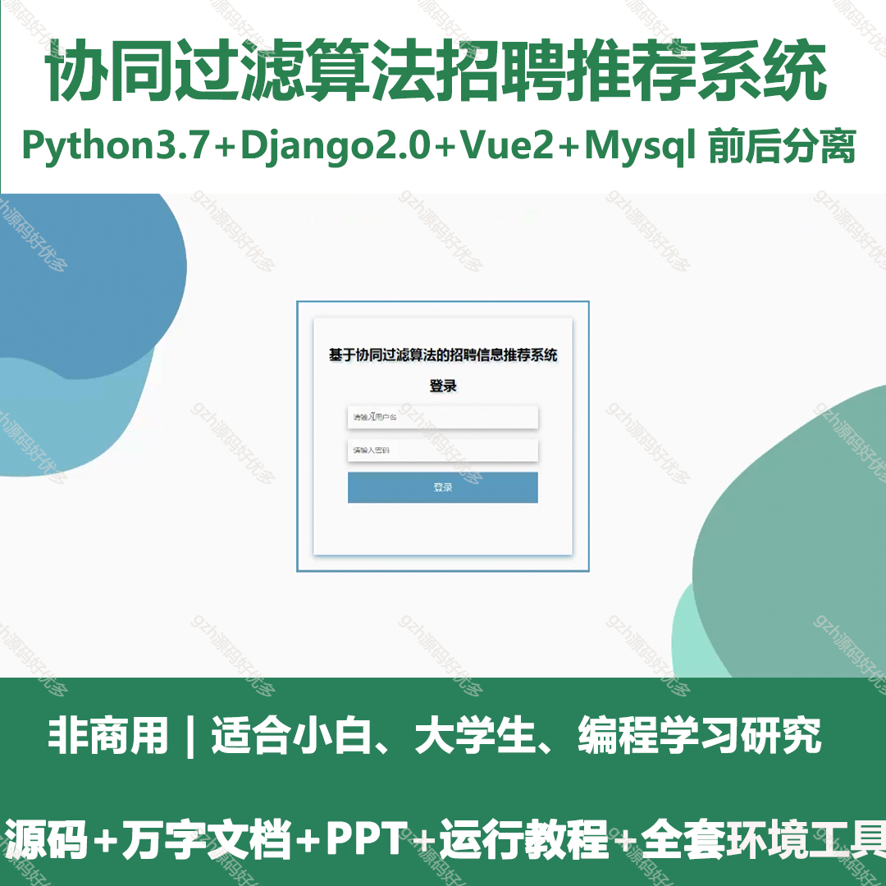
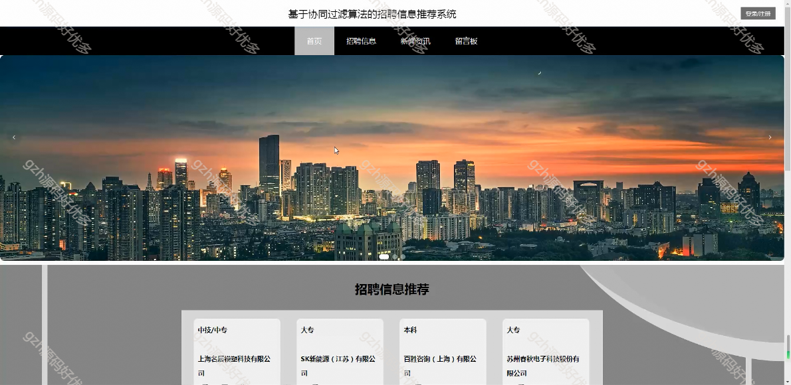
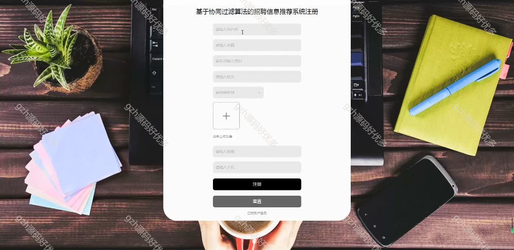
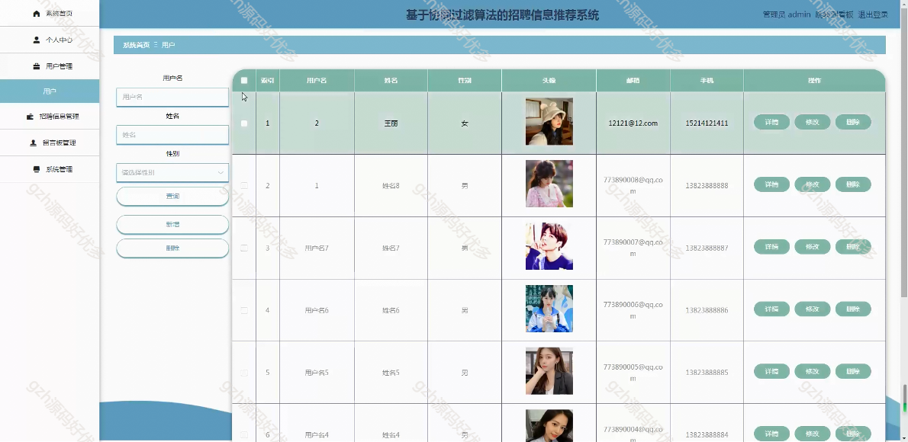
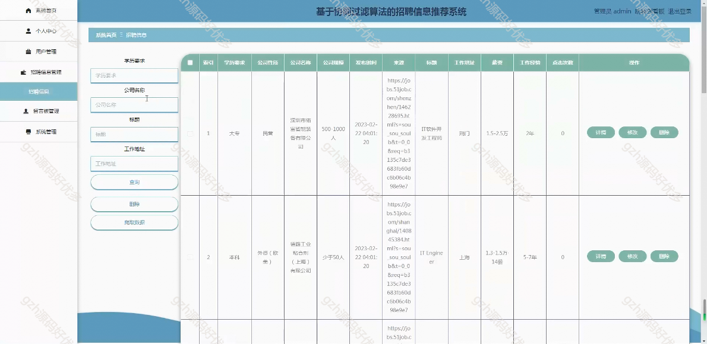
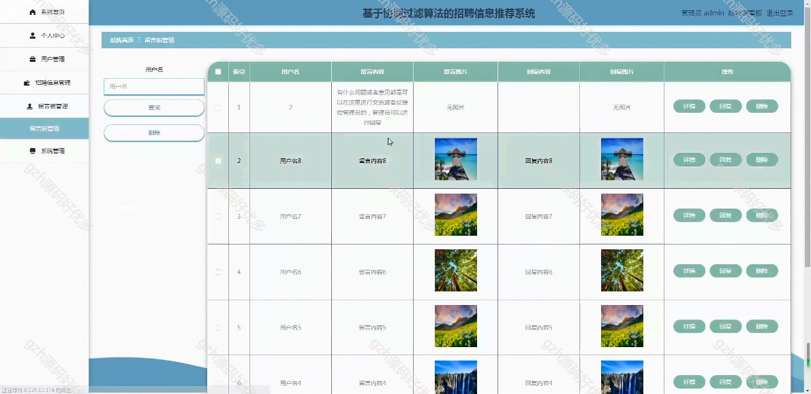
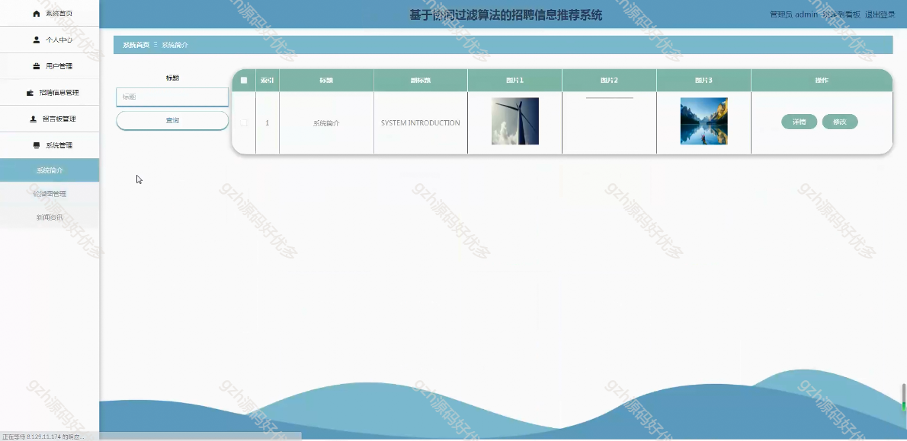
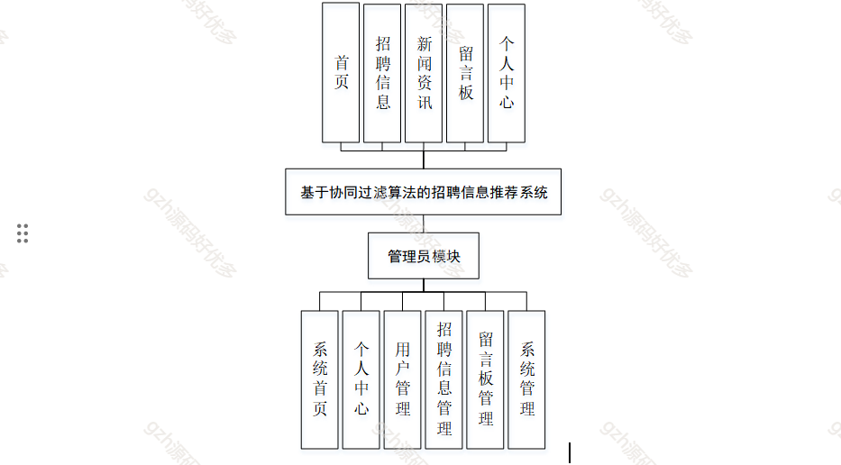
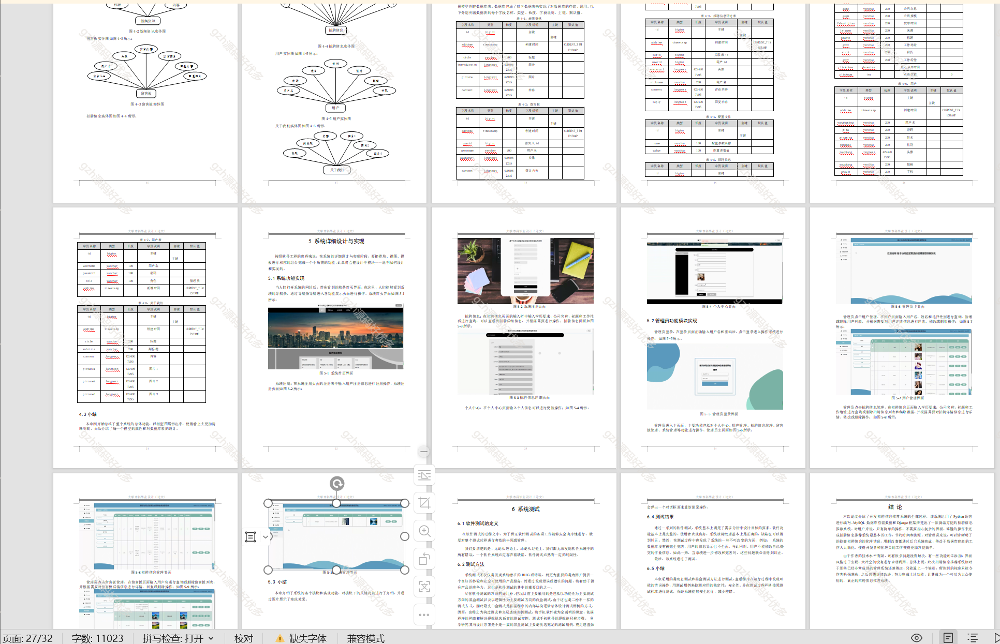

# python024
python024基于Django的协同过滤算法招聘推荐系统
 
## 查看主页获取源码

### 一、关键词

算法招聘系统、人才招聘系统、招聘推荐系统、就业求职

 

### 二、作品包含

源码+数据库+设计文档万字+PPT+全套环境和工具资源+部署教程

 

### 三、项目技术

前端技术：Html、Css、Js、Vue2.0、Element-ui
后端技术：Python3.7、Django2.0

  

 

### 四、运行环境（以下版本亲测，其他版本未知，请自测）

开发工具：PyCharm + VSCODE

数据库：MySQL5.7（最低要5.7版本）

数据库管理工具：Navicat10+

Python：Python3.7

前端Nodejs：14

浏览器：谷歌浏览器

 

### 五、项目介绍

项目编号：python024

随着网络科技的不断发展以及人们经济水平的逐步提高，计算机如今已成为人们生活中不可缺少的一部分，为招聘信息方便管理。

本系统解决了招聘信息管理中的主要问题，包括个人中心、用户管理、招聘信息管理、留言板管理、系统管理等功能。

 

### 六、运行截图

